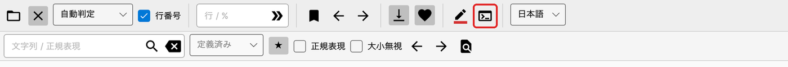
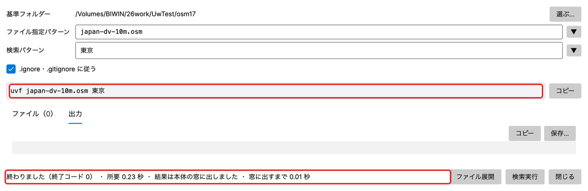
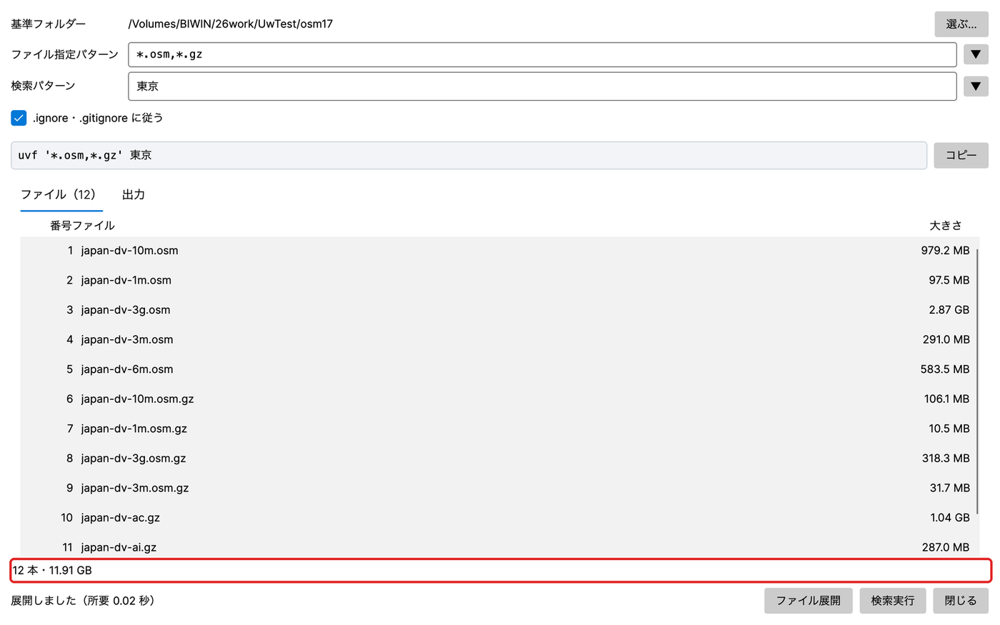
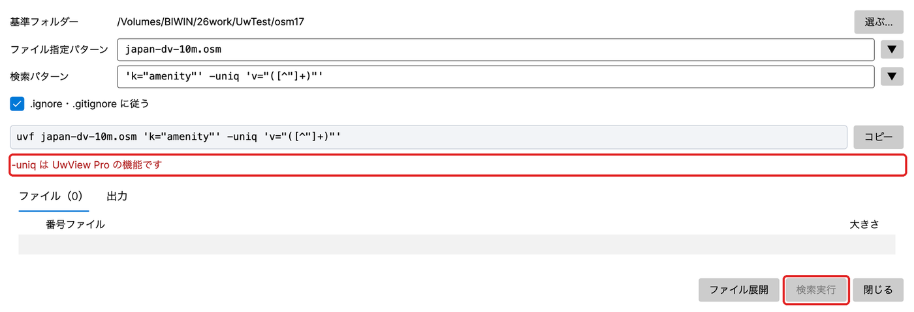
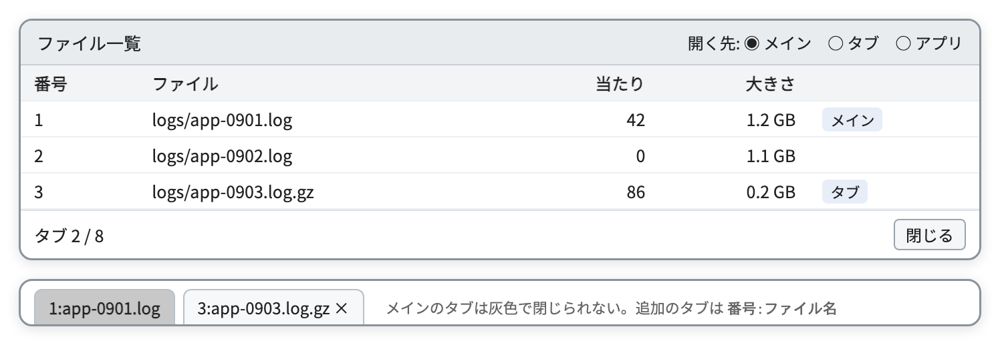

# UwView v1.8.1.9（Finder Scope）操作説明

UwView は、grep と vi を合わせたように使えるアプリです。CLI（`uvf` コマンド）でファイルから文字列を検索し、GUI で数 GB〜数十 GB の巨大なファイルを瞬時に開いて、見ながら検索できます。CLI と GUI を1つにまとめ、v1.8.1.9 からは GUI の中でも CLI と同じ書き方で検索できます（8章）。

この説明書は GUI の操作をまとめたものです。`uvf` コマンドの使い方と最新情報は、blog サイト（<https://uvp.y42u.net/>）を見てください。

- uvf コマンド操作マニュアル：<https://uvp.y42u.net/uvf-manuaru/>

---

## 目次

1. 画面の構成
2. ファイルを開く
3. 大きなファイルの扱い（ページモードと行モード）
4. 移動する（スクロール・ジャンプ・ミニマップ）
5. 検索する
6. 結果一覧（フィルタ結果）
7. 複数ファイルの結果（uvf -open から）
8. コマンドライン（uvf と同じ書き方で、画面から探す）
9. ファイル一覧とタブ
10. 色分けハイライタ
11. ブックマーク・末尾追従・お気に入り
12. 選択・コピー・保存
13. 圧縮ファイル
14. 文字コード・言語
15. uvf をコンソールで使えるようにする（コマンドライン設定）
16. キー操作・マウス操作の一覧
17. 設定の保存
18. 制限と注意
19. ブラウザ版の違い

---

## 1. 画面の構成


| 場所 | 内容 |
|---|---|
| メニュー | **ファイル**：開く… ／ コマンドライン…（8章） ／ 閉じる（今のタブ） ／ すべて閉じる ／ ブックマークを書き出す…（11章）。**ヘルプ**：使い方・最新情報・お問い合わせ（Web）、GitHub、コマンドライン設定…、バージョン情報（Mac はアプリ名メニューの「UwView について」） |
| 窓の題名 | `UwView(uvf)-Finder Scope(v1.8.1.9)` の形で、呼び名（Finder Scope）と版数が出ます。「UwView について」と `uvf --version` は正式名だけです |
| タブ | 1タブ＝1ファイル。ファイル名・索引作成の % ・×。多いときは1行のまま横にスクロール（ホイールで送れる） |
| ツールバー | ボタンはアイコンだけです。**名前はマウスを乗せると出ます**（1.7.3 から、ほかの窓のボタンも同じ。はい／いいえ・開く／閉じる・保存・中止などは文字のまま）。言語の左にあるターミナルの形のボタンが「コマンドライン」です（8章） |
| ステータス | ファイルのパス／「行モード」か「ページモード」／位置（総行数・先頭の行、ページモードは % ）／文字コード／一時的な知らせ（4秒）。右に索引作成の進み具合と「キャンセル」、右端に直前の処理時間（マウスを乗せると直近10件） |
| ミニマップ | ファイル全体の縮図。**橙＝検索の当たり、青＝ブックマーク、灰色の帯＝今見ている位置** |
| スタート画面 | ファイルを開いていないとき。「ファイルを開く…」、最近使ったファイル、お気に入り（ダブルクリックで開く） |

---

## 2. ファイルを開く

| 方法 | 内容 |
|---|---|
| メニュー「ファイル → 開く…」／ツールバーの開く | ファイルを選ぶ（複数選べる。どの種類でも選べる） |
| ドラッグ＆ドロップ | 画面のどこに落としても開く（複数可） |
| スタート画面 | 最近使ったファイル（最大15件）・お気に入りをダブルクリック |
| OS から | Finder の「このアプリケーションで開く」、アイコンへのドロップ、起動中なら新しいタブで開く |
| コマンドから | `uvf -open app.log ERROR`（開いて検索まで）。7章 |
| 画面の「コマンドライン」から | uvf と同じ書き方で、ファイルを指定して探す（複数ファイルもまとめて）。8章 |

**前回の続き**：起動したときに「前回のファイル（N 件）を復元しますか？」と聞きます。「復元する」で前回の位置まで戻ります（索引を待たずに近くが出ます）。「復元しない」でも記録は残り、次回また聞きます。

---

## 3. 大きなファイルの扱い（ページモードと行モード）

UwView は、**開いた瞬間から読める**ように、2段階で動きます。

| モード | いつ | できること |
|---|---|---|
| **ページモード** | 開いた直後（行の索引を作っている間） | 全体をスクロール・末尾へ・%でジャンプ。**行番号はまだ出ない** |
| **行モード** | 索引ができたあと | 行番号・行でジャンプ・行の選択・ハイライタのクイック着色 |

- 索引の進み具合はタブの % とステータスに出ます。**「キャンセル」で止めても、ページモードのまま読めます。**
- 索引ができる前に検索すると、**検索と索引作成を1回の読み込みで同時に**行います（無駄に2回読まない）。
- 1行の表示は先頭 8,192 文字までです（それ以降は「…（省略）」）。

---

## 4. 移動する（スクロール・ジャンプ・ミニマップ）

| 操作 | 動き |
|---|---|
| ↑ ↓ ／ ホイール | 1行ずつ／3行ずつ |
| PageUp ／ PageDown | 1画面ずつ |
| Ctrl（Mac は Cmd）＋Home ／ End | 先頭／末尾 |
| ← → ／ Shift＋ホイール ／ 横スワイプ | 横にスクロール。Home で左端へ |
| ミニマップをクリック・ドラッグ | その割合の位置へ |
| **ジャンプ欄** に入れて Enter（または移動ボタン） | `50%` → 半分の位置／`12345` → 12345 行目（行モード）。ページモードで数字だけのときは**バイト位置** |

- ジャンプ欄は **Enter でも移動ボタンでも**実行できます（1.7.3.6 から）。Ctrl（Cmd）＋L でジャンプ欄へ移れます。
- 移動した行は画面の中央に来て、水色で強調されます。

---

## 5. 検索する

1. 検索欄に語を入れて **Enter**（または 🔍）。Ctrl（Cmd）＋F で検索欄へ移れます。
2. 進み具合の窓が出ます（割合・件数・「中止」）。終わったら「閉じる」。当たりがあれば**結果一覧が自動で開きます**（6章）。
3. 当たった語は**黄色**で強調され、ミニマップに橙の線が出ます。

| 部品 | 意味 |
|---|---|
| **正規表現** | 検索語を正規表現として扱う。**外すと速い文字列検索**（既定は外れています） |
| **大小無視** | 英字の大文字・小文字を区別しない |
| ◀ 前へ ／ 次へ ▶ | 前後の当たりへ移る（今画面で強調している行、なければ画面の先頭から）。キーは Shift＋F3 ／ F3（Mac は Cmd＋Shift＋G ／ Cmd＋G も） |
| 件数 | 「N 件」→ 移ったあとは「3/8,739 件」。上限で止めたときは「（上限で打切り）」 |
| クリア | 検索を消す（検索語を空にして Enter でも同じ） |
| **検索履歴** | 検索欄に最近の50件が候補として出る |
| **定義済み ★** | 今の検索（語・正規表現・大小無視）を★で保存し、一覧から選ぶとすぐ検索する |

- 探すのは**今のタブの1ファイル**です。
- 正規表現は .NET の正規表現です（書き方は blog サイトの「uvf コマンド操作マニュアル」）。書き間違いは「正規表現が正しくありません」と出ます。
- 件数の上限はありません（無制限）。

---

## 6. 結果一覧（フィルタ結果）

検索バーの「結果一覧」で、当たった行だけを別の窓に並べます。

| 部品 | 意味 |
|---|---|
| 件数 | C/Total |
| **前後 ± N 行** | 当たった行の前後も出す（**無料版は ±1 まで**）。前後の行は淡色、区切りに「⋯」 |
| 行番号を含める | 保存するときに行番号を付ける（既定オン） |
| 保存… | 表示している内容をファイルに書く（`名前-filter.txt`、UTF-8） |

- **ダブルクリック／Enter で、本体のその行へ移ります**（中央寄せ＋水色）。
- 選択：クリック、Ctrl（Cmd）＋クリックで追加、Shift＋クリックで範囲、ドラッグ。Ctrl（Cmd）＋A で全部、Ctrl（Cmd）＋C でコピー。右クリックで「コピー」「ファイルに保存…」。
- 窓を閉じても、±N や位置は覚えています。

---

## 7. 複数ファイルの結果（uvf -open から）

コマンドで複数のファイルを探し、**結果を画面で見る**ことができます。

```bash
uvf -open '*.log' ERROR
uvf 'logs/**/*.log' timeout -i -open
```

**開いた直後**

- **ファイル番号 1** がメインのタブに出ます。
- 結果の窓が開きます（検索語が無ければファイル一覧が開きます）。
- 画面は探し直しません（コマンドの結果をそのまま使います）。

**結果の窓**

```
1:128     2026-09-27 10:01:02 ERROR connection reset
1:512     2026-09-27 10:05:44 ERROR timeout
3:7       2026-09-27 11:00:00 ERROR disk full
```

- 行番号欄は **`ファイル番号:行番号`**。番号と実際のファイル名は**ファイル一覧**（9章）で分かります。行を選ぶと、窓の下に「番号: 実際のパス」が出ます。
- 題名に「指定・検索語・N ファイル・M 件」。

**ダブルクリック（または Enter）で、元のファイルのその行を見る**

| 状況 | 動き |
|---|---|
| そのファイルがメインに出ている | その行へ移るだけ |
| そのファイルが追加のタブで開いている | そのタブに切り替えて移る |
| どこにも開いていない | **メインの中身をそのファイルに差し替えて**移る |

- 大きなファイルは開くのに時間がかかります。ステータスに「開いています… 3:128394」と出ます。待っている間に別の行をダブルクリックすると、**後のほうが優先**です。
- 開いたファイルでは、そのファイルの当たりが黄色になり、◀▶ で移れます（メイン画面の C/Total はそのファイルの中、結果の窓の C/Total は全体の中の位置）。
- **圧縮ファイル**は、確認を出さずに隣に展開して開きます（展開済みで新しければそれを使います）。
- 検索した後にファイルが変わっていたら「行がずれている可能性があります」と出ます。消えていたら「ファイルが見つかりません」。

**制限（UwView Pro との違い）**

| 項目 | UwView | UwView Pro |
|---|---|---|
| 結果から元の行へ | ファイルを開き直す（大きいと待つ） | 束ねた索引の中をすぐ移る |
| 画面の検索欄 | **メインの1ファイルだけ**を探す。全体を探し直すのは画面の「コマンドライン」（8章）かコマンドから | 束ねた全体を探す |
| 渡せる件数 | 最大 100 万件（各行は先頭 1,000 文字） | — |
| 前後 ± N | 出ない（1 本のファイルを画面で検索したときは ±1 まで） | ±64 まで |

---

## 8. コマンドライン（uvf と同じ書き方で、画面から探す）

1.8 から、画面の中で **uvf のコマンドと同じ書き方**で探せます。ターミナルを開かずに、複数のファイルや圧縮ファイルをまとめて探し、結果を本体の窓で読めます。

### 開き方

どれでも同じダイアログが開きます。

- ツールバーの「コマンドライン」ボタン（ターミナルの形。言語の左）
- メニュー「ファイル → コマンドライン…」
- Ctrl＋Shift＋K（Mac は Cmd＋Shift＋K）



- ダイアログは窓ごとに1つです。開いたままで本体を操作できます。もう一度開くと前に出ます。
- ［閉じる］で閉じても、入れた値は残ります。

### ダイアログの部品



| 部品 | 意味 |
|---|---|
| **基準フォルダー**・［選ぶ…］ | コマンドを打つフォルダーにあたる所。ファイル指定パターンの相対パスは、ここから解きます |
| **ファイル指定パターン** ▼ | コマンドの1つ目（ファイルの部分）と同じ書き方。`app.log`・`*.log`・`*.osm,*.gz`（カンマで並べる）・`logs/**`（下のフォルダー全部）・絶対パス。**引用符は要りません**（あっても同じ） |
| **検索パターン** ▼ | コマンドの2つ目から後ろ（検索語とオプション）と同じ書き方。`ERROR -i`・`'K="NAME[^"]*"' -E -i`。**引用符と `\` はシェルと同じに読みます**。Enter で実行 |
| ☑ .ignore・.gitignore に従う | オンは ripgrep と同じ除外の規則。オフはコマンドの `--no-ignore` と同じ |
| **コマンドの行**・［コピー］ | 2つの欄から組み立てた `uvf …` の行。入れるたびに書き換わります。基準フォルダーでターミナルに貼れば、同じ結果になります。Windows には［コピー（PowerShell）］もあります（引用の規則が違うため） |
| 誤りの表示（赤字） | 書き方の誤りを、コマンドと同じ言葉で出します。誤りがある間は［検索実行］を押せません |
| タブ「ファイル（N）」 | ［ファイル展開］の一覧（番号・ファイル・大きさ）。行をダブルクリックすると本体で開きます |
| タブ「出力」 | 文字で答えるもの（`--help`・`--version`・`--files` など）と、コマンドが出す知らせ（色を変えて上に出る）。［コピー］［保存…］ |
| 下の行 | 実行中の進み具合、終わったときの結果（終了コード・所要時間） |
| ［ファイル展開］／［検索実行］／［閉じる］ | 一覧を作る／探す／閉じる。実行中は［中止］で止められます |

コマンドとの対応は次のとおりです。

| コマンド | ファイル指定パターン | 検索パターン |
|---|---|---|
| `uvf app.log ERROR` | `app.log` | `ERROR` |
| `uvf japan.osm 'K="NAME[^"]*"' -E -i` | `japan.osm` | `'K="NAME[^"]*"' -E -i` |
| `uvf '*.osm,*.gz' 東京` | `*.osm,*.gz` | `東京` |
| `uvf 'linux/**' spinlock -i` | `linux/**` | `spinlock -i` |

### 探す（［検索実行］）

- 基準フォルダーでコマンドを打ったのと同じことを、画面の中で行います。**結果は本体の窓に出ます**（コマンドの `-open` と同じ。ダイアログの「出力」には出ません）。
  - 1本のファイル：そのファイルをタブで開き（開いていればそのタブで）、結果一覧に出します（6章）。
  - 複数のファイル：複数ファイルの結果として出します（7章）。続けて実行すると、前の結果のタブ・窓・ファイル一覧を片付けてから出し直します。
- 実行中は、何本目／全体・読んだ量・残りの目安・経過を出します。［中止］で止めると「中止しました」と出ます。
- 終わると下の行に「終わりました（終了コード 0）・所要 N 秒・結果は本体の窓に出しました・窓に出すまで N 秒」のように出ます。終了コードはコマンドと同じです（0＝あった・1＝無かった・2＝誤り）。
- 結果を文字で欲しいときは、［保存…］で書き出します（中身はコマンドの出力と同じです）。
- 検索パターンに `-open` を書いても無視します（「-open は画面の中では要りません」と出ます）。
- 検索語を書かずに実行すると、ファイルの一覧だけを出します（コマンドの `--files` と同じ）。

### 探す前に確かめる（［ファイル展開］）



- ファイル指定パターンを広げて、対象のファイルを一覧にします（`--files` と同じ広げ方）。
- 下に、本数・大きさの合計、`.gitignore` などで除外した本数を出します。1,000 本を超えると「1,000 本を超えています（続けます）」と出ます。読めないファイルには ⚠ が付きます。

### Pro の機能を書いたとき



- `-uniq`・`-seq`・`-grep` などの UwView Pro の書き方は、「-uniq は UwView Pro の機能です」と出して実行しません。
- zip・tar.gz・OSM の pbf は無料版では探せません（展開してから探してください）。

### 基準フォルダーと履歴

- 基準フォルダーは、次の順に最初から入っています。
  1. ターミナルで `uvf … -open` として画面を開いたときは、打ったフォルダー（その起動で最初の1回だけ）
  2. 前に使った基準フォルダー
  3. 今のタブのファイルのフォルダー
  4. ホーム
- 実行した値（基準フォルダー・2つの欄・除外のチェック）は 50 組まで残ります。2つの欄の ▼ から選ぶと、1組まとめて戻ります。開いたときは前回の値が入っています。

---

## 9. ファイル一覧とタブ

複数ファイルの結果を開いているとき、検索バーと結果の窓に**ファイル一覧**のボタン（箇条書きのアイコン）が出ます。



- 行を**ダブルクリック／Enter** で開きます。
- **「タブで開く」**（右上）
  - **オフ（既定）**：メインの中身をそのファイルに差し替え、先頭を出す
  - **オン**：**追加のタブ**で開く。タブ名は `3:ファイル名`
  - 状態は覚えています（次回も同じ）
- **タブは最大 8 個（メイン 1 ＋ 追加 7）**。8 個あるときは開かずに「タブは 8 個までです（メイン＋7）。どれかを閉じてから開いてください」。古いタブを勝手に閉じることはありません。この上限は、この一覧から開くタブだけに数えます（「ファイル → 開く」のタブは数えません）。
- 既に開いているファイルは、そのタブに切り替えるだけです（同じファイルを2つ開かない）。
- **メインのタブは閉じられません**（×が出ません）。結果の窓とファイル一覧のもとになっているためです。
- **メインのタブは灰色**です。追加のタブと見分けられます（1.7.3.4 から）。
- タブ名が 27 文字を越えると、末尾を `...` にして 27 文字に縮めます。タブにマウスを重ねると、切らないファイル名（2 行目は場所）が出ます。
- 検索結果のダブルクリックは、「タブで開く」に関係なく**メイン**で開きます（7章）。

---

## 10. 色分けハイライタ

検索とは別に、**決めた語や式を常に色分け**して表示します（ERROR は赤、WARN は黄、など）。

**管理画面**（ツールバーのハイライタ）

| 部品 | 意味 |
|---|---|
| 規則を追加（＋）／プリセット | 規則を足す。プリセットは7種：汎用ログレベル、syslog / Linux、Web access (HTTP)、JSON ログ、GeoJSON、KML、GNSS NMEA |
| 規則の列 | ▲▼（優先順。**上ほど優先**）、有効、✕、色見本、パターン、正規表現、Aa（大小無視）、行全体（行全体を塗る）、文字色・背景色 |
| 読込（再読み込み）・エクスポート…（上矢印）・インポート…（下矢印） | 規則のセットを切り替える／ファイル（`.uwvhl`）に書く・読む |
| 保存 | 名前を付けて保存して閉じる |
| 設定（チェック） | 今の名前で確定して閉じる |
| 閉じる | 変更を捨てて閉じる |

- （　）の中はボタンのアイコンです。名前はマウスを乗せると出ます。
- 色は 8〜12 色までにするのがおすすめです（多いと見分けにくい）。
- セットは**タブごと**に選べます。
- 検索の黄色は、ハイライタの色より優先されます。

**クイック着色**（行モードのとき）

- 本文の語を**ダブルクリック**すると語を選びます（もう一度で記号まで広げ、3回目で解除）。
- **右クリック**で小さな窓：コピー（アイコン）、10色の見本、色を消す（アイコン）、管理…（パレットのアイコン）。色を選ぶとその語が着色されます。

---

## 11. ブックマーク・末尾追従・お気に入り

| 機能 | 使い方 |
|---|---|
| **ブックマーク** | 画面の**先頭の行**に付ける／外す。行番号欄の左端とミニマップに青い印。◀▶ ボタン（`[` `]`）で前後のブックマークへ。Ctrl（Cmd）＋B で付ける・外す。**ファイルごとに覚えて、同じファイルを開くと戻ります**（1.7.3.6 から） |
| **末尾追従** | オン・オフは Ctrl（Cmd）＋Shift＋F でも。オンにすると末尾へ移り、1秒ごとに追記を見て、増えたら末尾へ送る（`tail -f` と同じ）。追記だけに対応（ファイルの切り詰め・ローテーションには追従しません） |
| **お気に入り** | ハートのアイコンで今のファイルを登録／解除。スタート画面に出る |

**ブックマークを残す**（1.7.3.6 から）

- ファイルごとに自動で覚え、同じファイルを開くと戻ります（前回の復元をしなくても戻ります）。
- 追記されただけのファイルなら戻ります。中身が変わっていたら（先頭が変わった・作り直された等）戻さず、「◯◯ は前回から変わっているので、ブックマークを戻しませんでした」と出ます。
- ブックマークを全部外すと、そのファイルの記録も消えます。覚えるのは最近の 500 ファイルまでです。
- ファイルメニュー「**ブックマークを書き出す…**」：`名前-bookmarks.txt` に「行番号<TAB>本文」で書き出します。行番号を数え終わってから使えます（途中なら案内が出ます）。

---

## 12. 選択・コピー・保存

**本文**（行モードのとき）

- 左ドラッグで**行の範囲**を選ぶ（端に行くと自動でスクロール）。クリックか Esc で解除。
- Ctrl（Cmd）＋C でコピー。右クリックで「コピー」「ファイルに保存…」。
- **10 万行を超える**コピーは、自動でファイル保存に切り替わります。
- ステータスに「選択 n 行」と出ます。

**結果一覧**：6章。

---

## 13. 圧縮ファイル

gz・bz2・xz・lzma・zstd のファイルを開くと、開き方を聞きます。

| 選択肢 | 動き |
|---|---|
| **テキストに展開して開く** | 同じフォルダーに展開してから開く（gunzip と同じ結果） |
| .uwvz に変換して開く（Pro） | UwView Pro の機能です（選べません） |
| やめる | 開かない |

- 展開済みのファイルがあれば「それを開く／展開し直す」を聞きます。
- 空き容量が足りなそうなら（圧縮の約4倍が目安）「続ける／やめる」を聞きます。
- 展開中は進み具合と「中止」が出ます。
- **zip は開けません**（展開してから開いてください）。tar・二重圧縮なども理由を示して断ります（ファイルが壊れているとは限らないので、消さないでください）。
- コマンドの uvf は、これらを**展開せずにそのまま検索**できます（blog サイトの「uvf コマンド操作マニュアル」）。

---

## 14. 文字コード・言語

- **文字コード**（ツールバー）：自動判定・UTF-8・UTF-8 (BOM)・Shift-JIS・EUC-JP・UTF-16LE・UTF-16BE。切り替えても索引は作り直しません。ステータスに「（自動: 判定した名前）」か「（手動）」が出ます。タブごとに覚えます。
- **言語**（ツールバー）：日本語／English。覚えます。最初は OS の言語に従います。

---

## 15. uvf をコンソールで使えるようにする（コマンドライン設定）

メニュー「ヘルプ → コマンドライン設定…」で、コンソールから `uvf` と打てるようにします。

| OS | 動き |
|---|---|
| Windows | ユーザーの PATH に追加（管理者権限は不要） |
| Mac・Linux | `/usr/local/bin` にリンクを作る（管理者のパスワードを聞かれることがあります）。Linux で権限が無ければ `~/.local/bin` |

登録済みなら「登録し直す／解除する」。ディスクイメージ（dmg）から直接起動しているときは、先にアプリケーションフォルダーへ入れるよう案内します。

---

## 16. キー操作・マウス操作の一覧

**本文**

| 操作 | 動き |
|---|---|
| ↑ ↓ ／ PageUp PageDown | 1行／1画面 |
| ← → ／ Home | 横に1文字／左端へ |
| Ctrl（Cmd）＋Home ／ End | 先頭／末尾 |
| ホイール ／ Shift＋ホイール | 3行ずつ／横スクロール |
| 左ドラッグ | 行の範囲を選ぶ |
| Ctrl（Cmd）＋C ／ Esc | コピー／選択の解除 |
| ダブルクリック | 語を選ぶ（クイック着色） |
| 右クリック | 着色の窓、または選択のメニュー |

**結果一覧・ファイル一覧**

| 操作 | 動き |
|---|---|
| ダブルクリック ／ Enter | その行へ移る／そのファイルを開く |
| ↑ ↓ PageUp PageDown（＋Shift） | 移る（Shift で選択を広げる） |
| Ctrl（Cmd）＋A ／ C | 全部選ぶ／コピー |

**そのほか**：検索欄の Enter で検索、ジャンプ欄の Enter で移動、ミニマップのクリック・ドラッグで移動、タブ列のホイールで横送り。

**ショートカット**（1.7.3.6 から。Mac は Ctrl を Cmd に読み替えます）

| キー | 動き |
|---|---|
| Ctrl＋F | 検索欄へ移る（文字を全部選ぶ） |
| F3 ／ Shift＋F3 | 次の当たり／前の当たり（Mac は Cmd＋G ／ Cmd＋Shift＋G も） |
| Ctrl＋L | ジャンプ欄へ移る。**ジャンプ欄で Enter を押すと移る** |
| Ctrl＋B ／ `[` ・ `]` | ブックマークを付ける・外す／前・次のブックマークへ |
| Ctrl＋Shift＋F | 末尾追従のオン・オフ |
| Ctrl＋Shift＋K | 「コマンドライン」ダイアログを開く（8章） |
| F5 | ファイルを読み直す（同じ位置・同じタブの並びで開き直す。覚えているブックマークは戻る） |
| Esc | 検索欄・ジャンプ欄から本文へ戻る |

- 検索欄・ジャンプ欄に文字を打っている間は、`[` `]` は文字として入ります。
- 複数ファイルの結果のタブ（`uvf -open`）は F5 で読み直しません（「このタブは読み直せません」と出ます）。
- キーの割り当ては変えられません（今の版では）。

---

## 17. 設定の保存

設定画面はありません。次のものは自動で覚えます（`<ユーザーのアプリデータ>/UwView/settings.json`）。

言語・ハイライタのセット・検索履歴（50件）・定義済みフィルタ・前回のファイルと位置・最近使ったファイル（15件）・お気に入り・「タブで開く」の状態・「コマンドライン」の基準フォルダーと履歴（50組）

---

## 18. 制限と注意

- 1行の表示は 8,192 文字まで。
- 改行は LF と CRLF。CR だけの改行には完全には対応していません。UTF-16 は行の区切りが厳密ではありません。
- 閲覧中にほかのプログラムがファイルを切り詰めると、落ちることがあります。
- Shift-JIS の文字列検索で、まれに文字の境目をまたいだ当たりが出ます（正規表現なら出ません）。
- zip は開けません。画面の検索欄は1ファイルずつです（複数ファイルは「コマンドライン」〈8章〉か uvf から）。
- フォントの大きさ・テーマは変えられません。

---

## 19. ブラウザ版の違い

- 最初に案内が出ます（目安 3GB・1億行まで、索引を作っている間はスクロールバーが使えない、など）。OK で閉じます。案内の「デスクトップ版を入手」（下矢印）・「UwView Pro を見る」（別の画面で開く）はアイコンです。
- メニューとバージョン情報はありません。結果一覧・ハイライタは画面の上に重ねて出ます。
- 使えないもの：パスを指定して開く、末尾追従、お気に入り、前回の復元、圧縮ファイルの確認、複数ファイルの結果とファイル一覧、ドラッグ＆ドロップ、「コマンドライン」（8章）。
- 設定は保存されません。
