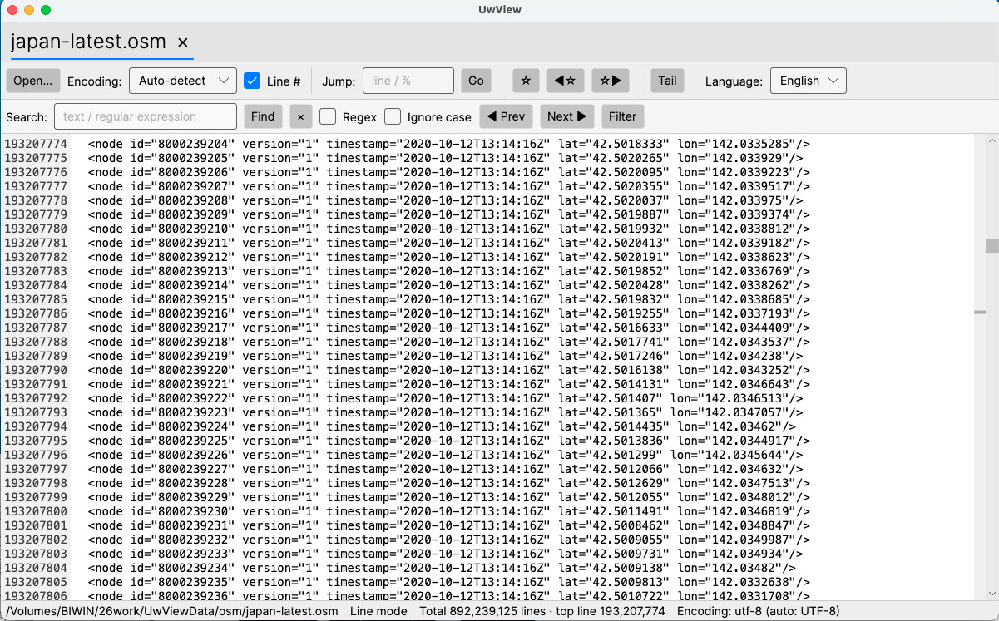

# UwView

*[日本語](README.md) ｜ English*

**A memory-thrifty, high-speed viewer for gigantic text files — hundreds of millions of lines and beyond.**



UwView is a rebuild (in [Avalonia UI](https://avaloniaui.net/)) of a large-text viewer originally published on the Japanese "Vector" archive. Ordinary editors choke around a million lines; UwView never loads the whole file into memory and **renders only the lines currently on screen**, so it opens huge line-count files — the kind produced by RDB or XML dumps — instantly. The largest file tested so far is **892 million lines / ~51 GB** (the full OpenStreetMap extract of Japan, as XML). If anyone finds the real limit, please let me know.

It is a **viewer**, not an editor (read-only).

## 📣 Announcement: "UwView Pro" — even faster — in development

We're building **UwView Pro**, which pushes large-file performance further. On top of parallel index construction, a **compressed sidecar cache** (`.uwvz` + `.uwvidx`) delivers instant re-open from the second time on, plus dramatically faster full-text search.

Measured against the well-known large-log viewer **[klogg](https://klogg.filimonov.dev/)** (same file, same patterns):

> Conditions: OpenStreetMap Japan `japan-latest.osm`, 47.73 GB / 892,239,125 lines, external USB drive (measured physical bandwidth 0.41 GB/s), 32 GB RAM, 10-core Mac, Match case ON. Hit counts matched exactly across klogg, UwView Pro, and direct raw-file search for every row (cross-verified that the searches are semantically identical).

| Metric | klogg (24.11.0) | UwView (public) | **UwView Pro (in dev)** | Pro ÷ klogg |
|---|---|---|---|---|
| First open | index build ~110 s (**only the top is visible** until done — can't scroll to middle/end) | index build 128–186 s (**whole file navigable immediately**) | 140 s to build index + compressed cache (**whole file navigable immediately**) | — |
| Re-open (2nd time on) | re-indexes every time, ~110 s (no persistent cache) | rebuilds every time, 128–186 s | **0.02–0.07 s** | **1,500×+** |
| Search literal `"Tokyo"` | 120–135 s | 156.2 s | **14.3 s** | **~9×** |
| Search case-insensitive `"Tokyo"` | ~120 s | (not measured) | **14.0 s** | **~8.6×** |
| Search regex `"Tok[yi]o"` | ~130 s | (not measured) | **29.8 s** | **~4.4×** |
| Search regex `"name:en.*Tokyo"` | ~130 s | (not measured) | **29.2 s** | **~4.4×** |
| Disk footprint (archive mode) | 48 GB (original required) | 48 GB (original required) | **5.3 GB** (original can be deleted; checksum-protected) | **1/9** |

- **klogg shows only the top of the file while it indexes** (you can't jump to the middle or end). UwView displays by byte position, so you can move anywhere the moment it opens.
- With the compressed sidecar you can delete the original and keep just **~1/9 the size** (e.g. 48 GB → 5.3 GB), and still open it directly (checksum-protected).

> UwView Pro is being prepared as a commercial (paid) edition. Stay tuned.

## Highlights

- 🚀 **Instant display of gigantic files** — hundreds of millions of lines with a tiny memory footprint. The file body is never resident; the index is ~6 MB at 200 M lines.
- 📖 **Progressive open** — shows content the instant you open it (page mode) → builds the index in the background → promotes to line mode when done.
- 🈁 **Automatic encoding detection** — BOM + UTF-8 / Shift-JIS / EUC-JP / UTF-16, with manual override (no re-indexing).
- 🗂 **Multi-file tabs** — switch files as tabs (state preserved, per-tab background indexing). Add via drag & drop or multi-select.
- 🔎 **Search & regular expressions** — background scan independent of the index. Literal search uses SIMD byte-scanning (3.4 s over 200 M lines); regex decodes per line (12.7 s). Hits are byte-offset based, so they stay valid in page mode and after an encoding switch. Match highlighting + a minimap of hit distribution (click to jump).
- 🧵 **Line filter view** — show only matching lines (original file untouched, virtual view), with the original line numbers.
- ⭐ **Bookmarks** — toggle any line, jump prev/next. Kept by byte offset, so they survive encoding switches. Shown in the minimap.
- 📡 **Real-time tail** — detects appends, re-maps mmap, extends the index incrementally, and auto-scrolls to the end. Opens logs that are still being written (FileShare.ReadWrite).
- 🌐 **Bilingual UI** — Japanese / English, switchable at runtime (persisted).
- 🖥 **Identical rendering on every OS** — Avalonia's own Skia rendering makes Windows / macOS / Linux look the same. A browser (WASM) build ships a bundled Japanese font.

## Requirements

- .NET 10 (`global.json`: `10.0.100`, rollForward `latestFeature`)
- Avalonia UI 12.x
- Primary OS: Windows / macOS / Linux (desktop)
- Bonus: browser (WASM). Building/running it needs the `wasm-tools` workload (`sudo dotnet workload install wasm-tools`).

## Architecture

The golden rule for huge files — *never load the whole file into memory, never put every line into the UI* — is realized in four layers.

```
UI layer (TextView: custom-drawn virtual text surface)  … draws only visible lines in Render
      ↓ GetPageAt(byteOffset) / GetLine(lineIndex)
Document layer (LineDocument)                            … on-demand fetch + LRU cache
      ↓
Index layer (SparseLineIndex)                           … one checkpoint every N lines (default 256)
      ↓ Read(offset, length)
I/O abstraction (IByteSource)                            … Desktop: mmap / Browser: Blob.slice
```

- **Sparse line index**: storing every line's offset would cost ~1.6 GB at 200 M lines, so UwView records one checkpoint every 256 lines (~6 MB) and re-counts newlines from the nearest checkpoint for any line.
- **`IByteSource`**: a thin abstraction of just `Length` and `Read(offset, buffer)` (plus `ReadAsync` for WASM). Upper layers don't know whether I/O is Desktop mmap or Browser `blob.slice` (async path + a 256 KB × 64 = 16 MB chunk cache).

## Benchmarks

Measured on an Apple Silicon Mac (external SSD) with `UwView.Bench`.

### Synthetic — 200 M lines / 5.1 GB (UTF-8)

| Metric | Result |
|--------|--------|
| open + encoding detection | 10 ms |
| page-mode display | 0 ms (no index needed) |
| index build (single sequential read) | 9.7 s (538 MB/s) |
| total lines | 200,000,000 (exact) |
| index size | 6.0 MB (781,251 checkpoints) |
| managed-heap growth | 9.3 MB |
| GetLine, 1000 random | avg 0.005 ms / p99 0.007 ms |
| jump to last (200 Mth) line | 0.003 ms |
| literal search | 3.4 s (1,521 MB/s) |
| regex search | 12.7 s (414 MB/s) |

### Real data — OpenStreetMap Japan, 51 GB / 892 M lines (UTF-8)

Verification well beyond 200 M lines, using the full OSM Japan extract converted to XML with `osmium`.

| Metric | Result |
|--------|--------|
| size | 51,254,526,392 bytes (~48 GiB) |
| open + encoding detection | 12 ms |
| page-mode display | 3 ms (no index needed) |
| index build | 172.8 s (283 MB/s, storage-bound) |
| total lines | **892,239,125** (matches `wc -l` exactly) |
| index size | 3,485,310 checkpoints ≈ 26.6 MB |
| managed-heap growth | 33.3 MB |
| GetLine, 1000 random | avg 1.28 ms / p99 3.0 ms |
| jump to last (892 Mth) line | 0.006 ms |

- Line numbers use `long` (and 892 M fits within the `int` limit ≈ 2.1 B anyway), so line count is never the bottleneck.
- GetLine is slower than on synthetic data (0.005 → 1.28 ms) because of external-SSD random reads, uneven real-XML line lengths, and 51 GB not fitting in cache — still millisecond-class and practical.
- Resident memory is only the ~26.6 MB index + ~33 MB heap; the file body stays non-resident. In practice storage capacity matters before line count does.

> Note: the reported WorkingSet looks large because it includes mmap file pages, which the OS reclaims on demand — it is not memory the app allocates.

Re-run:

```bash
dotnet run --project UwView.Bench -c Release -- <a huge text file>
```

## Build & run

```bash
# restore + build
dotnet build

# run the desktop app (macOS example)
dotnet run --project UwView.Desktop -c Debug
```

After launch, click **Open…** to choose a text file.

- **Jump**: a line number in line mode, or a ratio like `50%` in page mode.
- **Encoding**: auto-detect / manual switch from the toolbar dropdown.
- **Language**: switch Japanese / English from the toolbar dropdown (persisted).
- **Scroll**: wheel, ↑↓, PageUp/Down, Home/End, vertical scrollbar.

### Browser (WASM, bonus)

```bash
sudo dotnet workload install wasm-tools   # once (needs admin; relinks Skia natives)
dotnet run --project UwView.Browser        # Chromium-based browsers recommended
```

Same UI and same core as desktop. I/O is random reads via `blob.slice` (the whole file is never loaded into memory).

## Prebuilt binaries (`dist/`)

Self-contained archives (no .NET install required) for each OS / architecture:

| File | Target |
| --- | --- |
| `UwView-macos-arm64.zip` | macOS (Apple Silicon) |
| `UwView-macos-x64.zip` | macOS (Intel) |
| `UwView-win-arm64.zip` | Windows (ARM64) |
| `UwView-win-x64.zip` | Windows (x64) |
| `UwView-linux-arm64.tar.gz` | Linux (ARM64) |
| `UwView-linux-x64.tar.gz` | Linux (x64) |

macOS: unzip and launch `UwView.app` (unsigned — first launch: right-click → Open). Windows / Linux: run the bundled executable.

## Known limitations

- Newlines: LF / CRLF supported. Lone CR (classic Mac) is not fully supported yet.
- UTF-16 is recognized by BOM, but line splitting is byte-`\n` based, so the primary targets are UTF-8 / Shift-JIS / EUC-JP.
- mmap is a read-only view; if the file is truncated externally while open, access may crash (acceptable for a viewer). Tail supports appends only (not truncation/rotation).
- The literal fast byte-path can, rarely, produce a false hit straddling a character boundary in Shift-JIS (never in UTF-8). Use regex mode for strictness (matches after decoding).
- Browser build: file selection every time (no path open / drag&drop / tail), slower indexing, and unfetched ranges briefly appear blank until the chunk arrives.

## License

UwView is provided under the [PolyForm Internal Use License 1.0.0](LICENSE).

- **Free** for personal use and for the **internal business operations** of you and your company.
- You may **not redistribute** the software, embed it in a product/service, resell it, or provide it to third parties. A separate commercial (redistribution) license is required for those uses.
- Commercial license inquiries: [GitHub Issues](https://github.com/amru195704/UwView/issues)

## Disclaimer

Use at **your own risk**. The author assumes no responsibility for any trouble arising from the use of this software.
