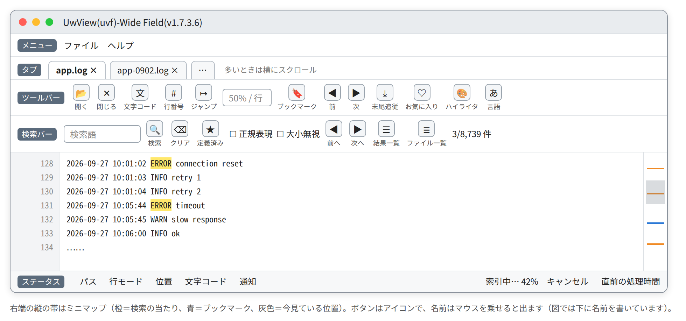

# UwView

*日本語 ｜ [English](README.en.md)*

**CLI で探して、GUI で読む。巨大なログ・テキストを調べるための CLI／GUI ツールです。**

**CLI（`uvf`）は ripgrep と同等の速さで探し、GUI は klogg と同等の速さで開きます。** 違うのは、その2つが**1回でつながる**ことです。`uvf ファイル '語' -open` と打てば、探し終えた瞬間に GUI が開き、当たった行が並びます。**GUI はもう一度探しません。**

📥 **[ダウンロード（無料）](https://github.com/amru195704/UwView/releases/latest)** ・ 🌐 **[公式サイト](https://uvp.y42u.net/)** ・ 🧪 **[ブラウザで試す](https://amru195704.github.io/UwView/)**  
📖 **[uvf コマンド操作マニュアル](2-doc/uvf_コマンド操作マニュアル.md)** ・ 🖥 **[GUI の操作マニュアル](2-doc/UwView_操作マニュアル.md)**（[PDF](2-doc/UwView_操作マニュアル.pdf)） ・ 🧾 **[v1.7.3.6 リリースノート](2-doc/release-body-v1.7.3.6.md)**

> **最新版は v1.7.3.6「Wide Field」。** 複数のファイルを、ワイルドカード1つでまとめて探せます。平文と **7 種類の圧縮ファイル**（gz・bz2・xz・lzma・zst・lz4・br）を混ぜても1回で済み、外部のコマンドは要りません。

---

## 数字で見る UwView

| こんなとき | 相手 | **UwView** |
|---|---|---|
| **圧縮したログを探す**（7 形式・979MB） | ugrep・ripgrep と**同等**／標準の grep（zgrep など）より **最大 2.73 倍速い** | **`uvf` が 7 形式すべてで最短** |
| **同じ圧縮ログを、もう一度探す** | どの道具も毎回展開し直す（bz2 は 7〜8 秒） | **`uvp` は形式によらず 0.11〜0.12 秒**（bz2 で `uvf` の **62 倍**） |
| **gz を 12 本・約 60GB 分まとめて探す** | zgrep 89.35 秒 | **`uvf` 17.60 秒（5.08 倍）** |
| **50GB を探して、当たった場所を GUI で読む** | klogg（開く＋検索）108.1 秒 | **`uvf … -open` 50.76 秒（2.13 倍）** |
| **50GB に、2問目を投げる** | ripgrep 55.50 秒 | **`uvp` 6.47 秒（8.6 倍）** |
| **258GB・45 億行を探して GUI へ** | klogg は開き終わるだけで 258 秒 | **`uvf … -open` 261.37 秒**で、探し終えて一覧まで出る |

**CLI も GUI も、ここまで全部無料版です**（`uvp` だけが [UwView Pro](https://uvp.y42u.net/pro/)）。

**先に負けを書きます。**

- **平文だけを複数まとめて探すと、ripgrep の方が少し速い**結果でした（平文 5 本で `uvf` は ripgrep の 1/1.17。1.5 倍未満なので同等の範囲です）。
- **3GB のファイルを続けてもう一度探すと、ripgrep の方が少し速い**です（0.32 秒 対 0.42 秒。これも同等の範囲）。メモリに載る大きさなので、2回目はキャッシュの読み出し勝負になります。
- **`uvp` は、複数のファイルを束ねる1回目に `uvf` の 2.34 倍かかります**（12 本で 41.23 秒 対 17.60 秒）。束ねた索引を書くぶんです。2回目からは `uvf` の 1.85 倍速いので、合計 4 回探せば逆転します。

> 1.5 倍未満の差は「同等」と書き、差とは呼びません。秒数は 1 台の Mac の値です（条件は[ページの最後](#数字の条件)）。**環境をまたいで秒数を比べないでください。**

---

## CLI：ripgrep・grep 系と比べる

### 圧縮したログを、そのまま探す（7 形式）

同じ 979MB のテキストを 7 形式で圧縮し、「東京」を探しました（hot・秒）。**出力の行数と中身は、すべての道具で `uvf` と一致**しています。

| 形式 | 標準の grep | ugrep 7.8.5 | ripgrep 15.2.0 | **`uvf`** | `uvp` 1回目 | **`uvp` 2回目** |
|---|---:|---:|---:|---:|---:|---:|
| gz | 0.90（zgrep） | 0.45 | 0.43 | **0.33** | 0.42 | **0.12** |
| bz2 | 8.03（bzgrep） | 7.62 | 7.89 | **7.43** | 7.64 | **0.12** |
| xz | 4.01（xzgrep） | 3.64 | 4.21 | **3.37** | 3.44 | **0.11** |
| lzma | 3.21（xzgrep） | 2.83 | 3.40 | **2.57** | 2.64 | **0.12** |
| zst | 0.63（zstdgrep） | 0.65 | 0.54 | **0.50** | 0.57 | **0.12** |
| lz4 | 0.65（lz4 -dc｜grep） | 0.33 | 0.31 | **0.28** | 0.35 | **0.12** |
| br | 1.33（brotli -dc｜grep） | 0.91 | 0.87 | **0.74** | 0.85 | **0.12** |

- **1回だけ探すなら `uvf` が 7 形式すべてで最短**です。ただし ugrep・ripgrep との差は 1.03〜1.36 倍で、**同等**です。
- **標準の grep には差がつきます**：gz で **2.73 倍**、lz4 で **2.32 倍**、br で **1.80 倍**（bz2・xz・lzma・zst は同等）。
- **`uvp` の2回目は、元が何の形式でも 0.11〜0.12 秒**です。1回目に作った索引（`.uwvz`）を探すので、元の形式の重さが消えます。`uvf` より **2.3〜62 倍**（bz2 62 倍・xz 31 倍・lzma 21 倍）。`uvp` の1回目は、索引を作りながらでも `uvf` と同等です。
- `uvf` は**外部のコマンドを呼びません**。`rg -z` は形式ごとに gzip・xz などを呼ぶので、そのコマンドが無い環境では黙って飛ばします。
- ag（The Silver Searcher）は、4 形式を展開できず、展開後 2GB を超えるファイルで落ちたため、比べる相手から外しました。

### 複数のファイルを、まとめて探す

| hot・秒 | zgrep | ugrep | ripgrep | **`uvf`** | `uvp` 1回目（束ねる） | **`uvp` 2回目** |
|---|---:|---:|---:|---:|---:|---:|
| gz 5 本（展開後 約 7.4GB） | 9.43 | 2.56 | 1.34 | **1.04** | 3.04 | **0.73** |
| gz 7 本＋平文 5 本＝12 本（展開後 約 60GB） | 89.35 | 25.38 | 24.62 | **17.60** | 41.23 | **9.52** |

- 12 本で、`uvf` は **zgrep の 5.08 倍**。ugrep・ripgrep とは同等（1.44 倍・1.40 倍）です。キャッシュを捨てた cold でも、`uvf` 21.35 秒・ugrep 26.85 秒と同等でした。
- **同じ 12 本を何度も探すなら `uvp`。** 12 本を1本の `.uwvz` に束ね、2回目からは `uvf` の **1.85 倍**速く探せます。

```bash
uvf '*.log' ERROR                    # 今のフォルダーの .log をまとめて
uvf '**/*.log' ERROR -open           # サブフォルダーも含めて探し、結果を GUI へ
uvf 'app.log,app.log.*.gz' ERROR     # 平文と圧縮を混ぜて、1回で
```

外すファイルは **ripgrep と同じ規則**です（`.ignore`・`.gitignore`・隠しファイル。外したくないときは `--no-ignore`）。

### 1本の大きなファイル

素の検索「東京」（秒・cold＝キャッシュを捨てた直後／hot＝続けて2回目）

| | ripgrep 15.2.0 | **`uvf`**（無料） | **`uvp`**（Pro・1回目は索引作成込み） |
|---|---:|---:|---:|
| 3GB | 3.26 ／ 0.32 | **3.04** ／ 0.42 | 3.43 ／ **0.29** |
| 10GB | 10.91 ／ 0.99 | 11.08 ／ 1.33 | 11.79 ／ **0.95** |
| 50GB | 56.06 ／ 55.50 | **51.49 ／ 50.52** | 58.42 ／ **6.47** |

**`uvf` はどの大きさでも ripgrep と同等**です。50GB では、ファイルがメモリに収まらないので、ripgrep も `uvf` も2回目が速くなりません。**`uvp` だけが 2回目 6.47 秒**——ripgrep の **8.6 倍**です。

検索 7 種（素・`-i`・`-E`・`-E` 行頭・`-E -i`・`-v`・`-E -v`）の cold＋hot 合計：

| | ripgrep | **`uvf`** | **`uvp`** |
|---|---:|---:|---:|
| 3GB | 31.25 秒 | 30.03 秒（同等） | **14.67 秒（2.13 倍）** |
| 10GB | 89.59 秒 | 88.01 秒（同等） | **30.25 秒（2.96 倍）** |
| 50GB | 828.97 秒 | 749.14 秒（同等） | **238.59 秒（3.47 倍）** |

全 96 項目（検索のほか、絞り込み・集計・並べ替え・先頭／末尾・書き出し・gz 入力など）を、rg・sed・sort・uniq・gzip の組み合わせと比べた総合は **2.46 倍**。**結果の不一致は 0 件**です。

> **Windows で `rg` を使っている方へ:** 50GB では `--no-mmap` を付けると **2.89 倍**速くなります → **[検証記事](https://uvp.y42u.net/blog/uvp-rg-no-mmap-50gb/)**

---

## GUI：klogg と比べる

| cold・秒 | 3GB | 10GB | 50GB |
|---|---:|---:|---:|
| **開く**：klogg 24.11.0 | 3.65 | 10.98 | 52.55 |
| **開く**：**UwView GUI** | **2.99** | **10.13** | **50.44** |
| **検索**：klogg | 0.56 | 11.75 | 55.59 |
| **検索**：**UwView GUI** | **0.32**（1.75 倍） | **10.15** | **53.50** |
| **探して読むまで**：klogg（開く＋検索） | 4.21 | 22.73 | 108.1 |
| **探して読むまで**：**`uvf … -open`** | **3.40** | **10.42（2.18 倍）** | **50.76（2.13 倍）** |

**開くのも検索も、klogg と同等**です（3GB の検索だけ 1.75 倍）。**差がつくのは「探して、読む」まで**。klogg はファイルを開くときに1回、検索でもう1回読みます。**`uvf … -open` は、探しながら1回読むだけ**です。

**GUI で「開くだけ」と、`uvf … -open` で「探して GUI に渡すまで」の差は、+0.41／+0.29／+0.32 秒。** ファイルが 17 倍になっても、探すぶんの上乗せは 0.3〜0.4 秒のままです。コマンドが終わってから GUI に結果一覧が出るまでは **0.03〜0.08 秒**。GUI は、受け取った位置を並べるだけだからです。

### 258GB でも、開いた瞬間から末尾を見られます

klogg は**索引ができるまで末尾へスクロールできません**。258GB では **4分18秒**、その間は先頭付近しか見えません。UwView は**先に全域を動けるようにしてから**、索引を裏で作ります。

| 258.68GB・45 億行 | 末尾まで行けるまで | GUI に出ているもの |
|---|---|---|
| klogg 24.11.0 | **4分18秒** | 索引ができるまで先頭付近だけ |
| **UwView（無料）** | **待たない** | 本文（行番号は索引ができてから・開き終わるまで 4分15.5秒） |
| **UwView Pro・1回目** | **待たない** | 無料版と同じ（索引を保存するぶん 5分18秒） |
| **UwView Pro・2回目以降** | **待たない**（**0.01〜0.07 秒**で開く） | 本文＋**行番号**（最初から） |

マウスホイールでも、スクロールバーのドラッグでも、`Cmd/Ctrl+End` でも、開いた直後から末尾まで行けます。行番号へのジャンプは、ファイルの大きさによらず体感で即時です（8.9 億行で 0.003ms）。



*GUI の構成（図）。検索の当たりは右端のミニマップにも出ます。詳しくは [GUI の操作マニュアル](2-doc/UwView_操作マニュアル.md)。*

---

## UwView Pro — 2回目から桁が変わります

1回目は、どの道具もファイル全体を1回は読まなければいけません。物理の話なので逃げ場はありません。違うのは**そのあと何が残るか**です。

`uvp` は1回目に **`.uwvz`**（圧縮形式＋索引。元の約 1/9）を作り、**2回目からは元のファイルに触りません。**

| 同じファイル・同じ語を2回目に探す（hot） | ripgrep | `uvf`（無料） | **`uvp`（Pro）** |
|---|---:|---:|---:|
| 50GB の平文 | 55.50 秒 | 50.52 秒 | **6.47 秒（ripgrep の 8.6 倍）** |
| 979MB の bz2 | 7.89 秒 | 7.43 秒 | **0.12 秒（`uvf` の 62 倍）** |
| gz＋平文 12 本（展開後 約 60GB） | 24.62 秒 | 17.60 秒 | **9.52 秒（ripgrep の 2.59 倍）** |

- **1回目は同等です**：50GB で `uvp` 58.42 秒 対 ripgrep 56.06 秒（索引を作りながら）。
- 絞り込み・集計・並べ替えなど **`uvp` だけの 16 項目**は、rg・sed・sort などの組み合わせより **5.12〜7.44 倍**速く終わります。
- **元ファイルを消しても `.uwvz` のまま探せて、`-extract` で戻せます。** 51.25GB が約 5.7GB になります。
- `.zip` の中のテキストや、OpenStreetMap の `.pbf` も入力にできます。
- GUI では、2回目以降は **0.01〜0.07 秒で開き、最初から行番号つき**です。

**`uvp` が効くのは、10GB を超えるファイルや圧縮したログに、2回以上聞くとき**です。1回きりなら無料版で足ります。

> 買い切り **$129** ／ 月額 **$9**（Edit Upgrade は +$120 ／ +$8）・**14 日間の無料試用** → **[UwView Pro](https://uvp.y42u.net/pro/)**

---

## インストール

**Mac（Homebrew）**
```bash
brew install --cask amru195704/uwview/uwview
```
**Windows（Scoop）**
```powershell
scoop bucket add uwview https://github.com/amru195704/scoop-uwview
scoop install uwview
```
**Linux・手で入れる場合**は [GitHub Releases](https://github.com/amru195704/UwView/releases/latest) から dmg／zip／tar.gz を。

Homebrew と Scoop は、どちらも公式の GitHub Releases から取得して SHA256 を照合します。**`uvf` コマンドもそのまま使えます。**
更新は `brew upgrade --cask uwview` ／ `scoop update uwview`。

---

## 使い方

```bash
uvf japan-latest.osm '東京' -open    # 探して、そのまま GUI で読む
uvf app.log.zst ERROR                # 圧縮ファイルは展開しながら探す（7 形式）
uvf '**/*.log' ERROR --files         # 探さずに、対象になるファイルだけを出す
```

**探し終えた瞬間に GUI が開き、行番号つきの結果一覧が出ます。** あとは、前後の行を読む・一覧からジャンプする・複数のキーワードを色分けする・条件を変えて探し直す——調べる作業は、この行き来でできています。複数のファイルの結果は、ファイル一覧から追加のタブ（最大 8 個）でも開けます。

書き方・オプション・正規表現・終了コード・ripgrep との対応表は **[uvf コマンド操作マニュアル](2-doc/uvf_コマンド操作マニュアル.md)**、
GUI の使い方（検索・結果一覧・ファイル一覧とタブ・ハイライタ・キー操作）は **[GUI の操作マニュアル](2-doc/UwView_操作マニュアル.md)**（[PDF](2-doc/UwView_操作マニュアル.pdf)）にあります。

---

## どれを使えばいいか

| やりたいこと | 使うもの |
|---|---|
| **CLI で探すだけ** | **`uvf`**（無料）— ripgrep と同等 |
| **複数のファイル・圧縮したログをまとめて探す** | **`uvf '*.log' 語`**（無料・圧縮 7 形式） |
| **CLI で探して、当たった場所を GUI で読む** | **`uvf … -open`**（無料）— **いちばん短い道** |
| **GUI で開いて眺める** | **UwView の GUI**（無料）— 開いた瞬間から末尾までスクロールできる |
| **同じファイル・同じログに何度も戻る／圧縮したまま保管** | **[UwView Pro](https://uvp.y42u.net/pro/)**（`uvp`） |
| 巨大ファイルを**書き換える** | **UwView Pro ＋ Edit Upgrade** |
| 〜3GB・インストールしたくない | **[ブラウザ版](https://amru195704.github.io/UwView/)** |

**`uvf` も GUI も無料版に入っています。** 単体実行ファイル・インストーラ不要・Windows / macOS / Linux 共通。

---

## 主な機能

**CLI（`uvf`）**：`-i`・`-E`・`-v`・終了コード 0／1／2（当たりあり／なし／エラー。grep と同じ）・`-open`・`--json`・`--files`・`--tune`／
**複数ファイルをまとめて検索**（ワイルドカード・`**`・カンマ区切り・`.ignore`／`.gitignore` は ripgrep と同じ規則）／
**圧縮ファイル 7 形式をそのまま検索**（gz・bz2・xz・lzma・zst・lz4・br。外部コマンド不要・平文と混ぜても1回）

**GUI**：**実測最大 258.68GB・45 億行**（無料版で到達）／開いた瞬間から末尾までスクロール／検索結果一覧（元の行番号つき・ジャンプ・前後の文脈・保存）／
複数ファイルの結果を読む（ファイル一覧・最大 8 タブ）／複数キーワードの色分け（32 色・プリセット 7 種・`.uwvhl`）／ミニマップ／
文字コード自動判定（UTF-8・Shift-JIS・EUC-JP・UTF-16）／リアルタイム Tail／マルチタブ・ブックマーク・横スクロール・セッション復元／全 OS 同一描画

**動作環境**: .NET 10 ／ Avalonia UI 12.x ／ Windows・macOS・Linux

**既知の制限**：圧縮ファイルの中に **1 行が 64MiB を超える行**があり、その行が検索に一致すると、検索が止まることがあります（ファイルは壊れていません）。速度を優先するため対応の予定はありません。該当するファイルは展開してから開いてください。

---

## もっと詳しく

| | |
|---|---|
| 📖 **uvf コマンド操作マニュアル** | [2-doc/uvf_コマンド操作マニュアル.md](2-doc/uvf_コマンド操作マニュアル.md)（書き方・オプション・圧縮・正規表現・終了コード・ripgrep との対応表・性能） |
| 🖥 **GUI の操作マニュアル** | [2-doc/UwView_操作マニュアル.md](2-doc/UwView_操作マニュアル.md) ・ [PDF](2-doc/UwView_操作マニュアル.pdf)（GUI の構成・検索・結果一覧・ファイル一覧とタブ・ハイライタ・キー操作） |
| 🧾 **v1.7.3.6 Wide Field のリリースノート** | [release-body-v1.7.3.6.md](2-doc/release-body-v1.7.3.6.md) |
| 📊 **実測の全データと条件** | [ベンチマーク一覧](https://uvp.y42u.net/benchmarks/)（EmEditor・klogg・010 Editor・UltraEdit・Log Viewer・grep・ripgrep・amber を 3GB〜250GB で実測。**負けている数字もそのまま載せています**） |
| 📖 **klogg と正直に比べ直した話** | [記事](https://uvp.y42u.net/blog/uvp-klogg-open-lose-flow-win/) |
| 📖 **同じ 50GB を 3 つの土俵で測った** | [記事](https://uvp.y42u.net/blog/uvp-three-arenas-50gb/) |
| 📖 **ログの圧縮形式の選び方（7 形式を実測）** | [記事](https://uvp.y42u.net/blog/log-compression-format-choice/) |
| 📖 **ripgrep の `--no-mmap`** | [記事](https://uvp.y42u.net/blog/uvp-rg-no-mmap-50gb/) |
| 🔧 **機能の詳細・アーキテクチャ・ビルド手順・テスト** | [以前の README（v1.6.5 時点）](docs/README-v1.6.5.md) |
| 📰 **プレスキット** | [PRESSKIT.md](press-kit/PRESSKIT.md) |

---

## 数字の条件

- **機械**：MacBook Air（Apple M4・10 コア・メモリ 32GB）・外付け USB SSD。データは OpenStreetMap（日本）の XML、語は「東京」。**秒数は環境によって変わります。環境をまたいで秒数を比べないでください。**
- **CLI・1本の大きなファイル**：`uvf`／`uvp` 1.7.3.1（検索の処理は v1.7.3.6 と同じ）・ripgrep 15.2.0・2026-09-28。cold＝キャッシュを捨てた直後、hot＝続けて2回目。
- **CLI・圧縮 7 形式と複数ファイル**：`uvf` 1.7.3.4（検索の処理は v1.7.3.6 と同じ）／`uvp` 1.7.3.5（検索の処理は 1.7.3.6 と同じ）・ugrep 7.8.5・ripgrep 15.2.0・macOS 標準の zgrep／bzgrep／xzgrep／zstdgrep・2026-09-28。**hot**（各 2 回の速い方）。12 本の cold だけはオーナー計測。すべての測定で、出力の行数と中身を突き合わせています。平文 5 本の比較だけは `uvf` 1.7.2.7（cold＋hot）。
- **GUI と klogg**：最新の比較は v1.6.6・klogg 24.11.0・2026-09-20・cold。258GB は v1.6.6・2026-09-21。
- 1.5 倍未満の差は「同等」と書いています。

---

## 支援について

**UwView（無料版）は、これからも無料のままです。** 個人利用も、会社の中での業務利用も無料です。

もし役に立って、続いてほしいと思っていただけたら [GitHub Sponsors](https://github.com/sponsors/amru195704) からどうぞ。**任意です。**
**お金よりも助かるのは**、うまく動かなかった報告（どんなファイルで、どう困ったか）と、**手元の巨大ファイルで測った結果**です
——**負けていた、という報告が特にありがたいです** → [Issues](https://github.com/amru195704/UwView/issues)

開発資金は主に [UwView Pro](https://uvp.y42u.net/pro/) の売上でまかなっています。**Pro を買っていただくのが、いちばん直接的な支援です。**

## ライセンス

[PolyForm Internal Use License 1.0.0](LICENSE)。**個人利用・企業の社内業務利用は無料**です。
**再配布・製品/サービスへの組込み・転売・第三者への提供はできません**（別途「商用（再配布）ライセンス」が必要です → [Issues](https://github.com/amru195704/UwView/issues)）。
日本語の参考訳: [LICENSEjp.txt](LICENSEjp.txt)（正文は英語版）

> **パッケージマネージャへの登録について（明確化）**
> **Homebrew・Scoop・winget などのマニフェストから、公式の配布物（[GitHub Releases](https://github.com/amru195704/UwView/releases/latest)）を
> 参照する形は、再配布にあたりません。** 利用者の環境が公式の配布元から直接ダウンロードするためです。
> **こうした登録・PR は歓迎します。** マニフェストに記載するハッシュは、各リリースに添付している `SHA256SUMS` をお使いください。
> ファイルのコピーを配布元以外でホストする場合は、上記のとおり別途ご相談ください。

## 作者の関連プロダクト

測量士・土地家屋調査士向けの iOS アプリ群（同じ作者 y4u。UwView とは独立した製品です）:
**[GeoConverter Pro](https://gcpro.y42u.net/)**（座標変換）・**[GeoPrism JP](https://gmp.y42u.net/)**（測地系のズレの可視化）・**[GeoDiveExa](https://y42u.net/tec001/)**（RTK-GNSS 位置調査）
